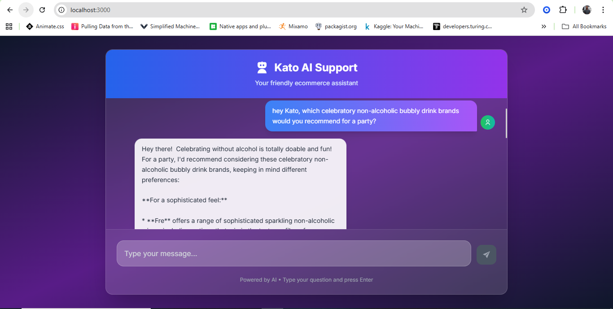
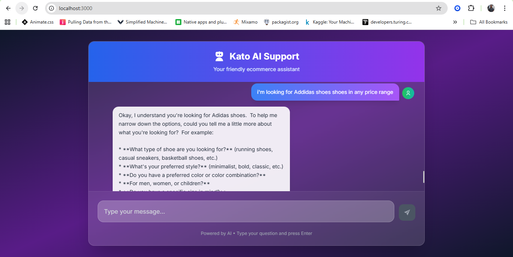

# AI-customer-chatbot

A modern, responsive customer support chatbot built with Next.js and powered by Google's Generative AI. This application provides intelligent, real-time assistance to customers with a clean, intuitive interface.

## 🚀 Features

- **AI-Powered Conversations**: Leverages Google's Generative AI for intelligent responses
- **Real-time Chat Interface**: Smooth, responsive chat experience
- **Modern UI**: Clean design with Tailwind CSS styling
- **Responsive Design**: Works seamlessly across desktop and mobile devices
- **React Icons Integration**: Beautiful, consistent iconography
- **Fast Performance**: Built on Next.js for optimal loading speeds

## 🛠️ Tech Stack

- **Frontend**: Next.js 14.2.5, React 18
- **AI/ML**: Google Generative AI
- **Styling**: Tailwind CSS 3.4.1
- **Icons**: React Icons 5.3.0
- **Development**: ESLint, PostCSS

## 📋 Prerequisites

Before running this application, make sure you have:

- Node.js (version 16 or higher)
- npm or yarn package manager
- Google AI API key (for Generative AI functionality)

## 🚦 Getting Started

### 1. Clone the repository

```bash
git clone <https://github.com/EthanBukenya/AI-customer-chatbot>
cd AI-customer-chatbot
```

### 2. Install dependencies

```bash
npm install
# or
yarn install
```

### 3. Set up environment variables

Create a `.env.local` file in the root directory and add your Google AI API key:

```env
GOOGLE_AI_API_KEY=your_google_ai_api_key_here
```

### 4. Run the development server

```bash
npm run dev
# or
yarn dev
```

Open [http://localhost:3000](http://localhost:3000) in your browser to see the application.

## 📸 Screenshots

<!-- Add your screenshots here -->



*Add your actual screenshot files to a `screenshots` folder and update the paths above*

## 🏗️ Project Structure

```
AI-customer-assistant-chatbot/
├── public/             # Static assets
├── screenshots/        # Project screenshots
├── .env.local         # Environment variables (create this)
├── package.json       # Project dependencies
└── README.md          # Project documentation
```

## 📜 Available Scripts

- `npm run dev` - Starts the development server
- `npm run build` - Creates an optimized production build
- `npm run start` - Starts the production server
- `npm run lint` - Runs ESLint for code quality checks

## 🔧 Configuration

### Google AI Setup

1. Visit [Google AI Studio](https://aistudio.google.com/app/apikey)
2. Create a new API key
3. Add the key to your `.env.local` file
4. Ensure your API key has the necessary permissions for Generative AI

### Customization

- **Styling**: Modify Tailwind classes in components or add custom CSS
- **AI Behavior**: Adjust prompts and parameters in your AI integration code
- **Icons**: Replace or add new icons using React Icons library


## 🤝 Contributing

1. Fork the repository
2. Create a feature branch (`git checkout -b feature/amazing-feature`)
3. Commit your changes (`git commit -m 'Add amazing feature'`)
4. Push to the branch (`git push origin feature/amazing-feature`)
5. Open a Pull Request

## 📝 License

This project is licensed under the MIT License - see the [LICENSE](LICENSE) file for details.

## 🆘 Support

If you encounter any issues or have questions:

1. Check the [Issues](../../issues) page for existing solutions
2. Create a new issue with detailed information
3. Contact the development team

## 🙏 Acknowledgments

- [Next.js](https://nextjs.org/) for the amazing React framework
- [Google AI](https://aistudio.google.com/) for powerful generative AI capabilities
- [Tailwind CSS](https://tailwindcss.com/) for utility-first styling
- [React Icons](https://react-icons.github.io/react-icons/) for beautiful icons

---

**Made with ❤️ using Next.js and Google AI**